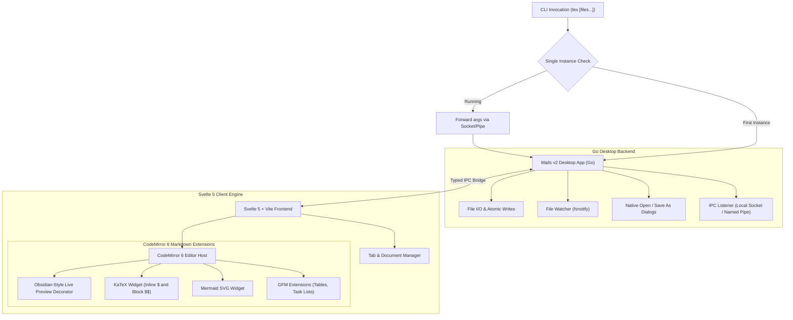

# Tex: Minimalist Markdown Notepad (Specification & Architecture)

**Tex** is an ultra-lightweight, distraction-free markdown notepad for Linux and Windows. It features a tabbed interface, CodeMirror 6-powered live preview rendering (Obsidian-style inline decorations), native math rendering (KaTeX), diagrams (Mermaid), and seamless CLI integration.

---

## 1. System Architecture

---

## 2. Core Decisions & Tech Stack

| Component | Choice | Justification |
| :--- | :--- | :--- |
| **App Shell** | **Wails v2 (Go)** | ~15MB binary, ~50MB RAM (vs 200MB+ in Electron). Native WebView2 on Windows and WebKitGTK on Linux. |
| **Frontend Framework** | **Svelte 5 (Runes)** | Near-zero runtime overhead, compiled reactivity, clean separation of concerns. |
| **Editor Core** | **CodeMirror 6** | True plaintext foundation. Allows Obsidian-style inline live preview widgets without corrupting raw markdown formatting. |
| **Math Engine** | **KaTeX** | Blazing fast formula rendering without heavy LaTeX engines. |
| **Diagram Engine** | **Mermaid.js** | Flowcharts, sequence diagrams, state machines inline in fenced code blocks. |
| **CLI / IPC** | **Unix Socket (Linux) & Named Pipe (Windows)** | `tex file.md` focuses the running app and opens the file in a new tab if already open. |

---

## 3. Key User Experience Features

1. **Tabbed Notepad**:
   - Tab bar with title, dirty indicator (`●`), close button.
   - Middle-click tab to close; `Ctrl+W` to close active tab.
   - Prompt to save unsaved changes before tab/window close.
2. **Obsidian-Style Live Preview**:
   - Headers, bold, italic, strikethrough, and blockquotes rendered directly inline.
   - Tokens (`#`, `**`, etc.) are hidden when cursor is outside the line; exposed immediately when cursor enters.
   - Interactive checklist items (`- [ ]` / `- [x]`).
   - Quick toggle between **Live Preview** and **Raw Source** mode (`Ctrl+E`).
3. **KaTeX & Mermaid Editing**:
   - Inline `$x^2$` and block `$$\sum_{i=1}^n i$$` render as mathematical notation.
   - `mermaid` blocks render as responsive SVG diagrams.
   - Clicking on a formula or diagram reveals the raw source text for immediate editing.
4. **CLI & Desktop Launch**:
   - `tex`: Launches blank untitled tab.
   - `tex lecture1.md lecture2.md`: Opens files in tabs.
   - If an instance is already running, passes paths to the active window and brings it to foreground.
5. **Cross-Platform**:
   - Tested and optimized for both Linux and Windows.
   - Line ending tolerance (CRLF / LF preservation).

---

## 4. Implementation Roadmap

- [x] **Phase 1: Project Scaffold & Desktop Harness**
  - Initialize Wails v2 project with Svelte 5 + TypeScript.
  - Implement CLI argument receiver and single-instance IPC handler in Go.
  - Verify build on Linux and Windows configurations.
- [x] **Phase 2: Tabbed Buffer Management & Native File I/O**
  - Tab state management (add tab, close tab, dirty status, switch active).
  - Go bindings for `ReadFile`, `WriteFile` (atomic), `OpenFileDialog`, `SaveFileDialog`.
  - External modification detection (`fsnotify`).
- [x] **Phase 3: CodeMirror 6 Editor & Live Preview**
  - Integrate CodeMirror 6 with GitHub-Flavored Markdown.
  - Build the Live Preview decoration plugin (inline header sizing, syntax hiding/revealing on cursor).
  - Implement Raw Source / Live Preview toggle (`Ctrl+E`).
- [x] **Phase 4: KaTeX & Mermaid Live Rendering**
  - KaTeX plugin for inline `$math$` and block `$$math$$`.
  - Mermaid dynamic renderer for `mermaid` fenced code blocks.
  - Click-to-edit cursor positioning.
- [ ] **Phase 5: Polish & Packaging**
  - Keyboard shortcuts (`Ctrl+N`, `Ctrl+O`, `Ctrl+S`, `Ctrl+W`, `Ctrl+Tab`, `Ctrl+F`).
  - Dark/light theme matching OS preference.
  - Distribution build targets (Linux binary, Windows `.exe`).
