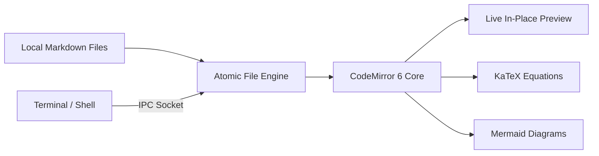

<p align="center">
  
</p>

<h1 align="center">Tex</h1>

<p align="center">
  <strong>A minimalist, distraction-free markdown notepad with Obsidian-style live preview, KaTeX math, Mermaid diagrams, and instant CLI integration.</strong>
</p>

<p align="center">
  <a href="https://github.com/edmrtz/tex/releases"></a>
  <a href="https://aur.archlinux.org/packages/tex-bin"></a>
  <a href="https://github.com/microsoft/winget-pkgs/tree/master/manifests/e/edmrtz/tex"></a>
  <a href="LICENSE"></a>
  <a href="#installation"></a>
</p>

<p align="center">
  <a href="#overview">Overview</a> •
  <a href="#key-features">Key Features</a> •
  <a href="#installation">Installation</a> •
  <a href="#cli-and-ipc-integration">CLI & IPC</a> •
  <a href="#keyboard-shortcuts">Shortcuts</a> •
  <a href="#preferences-and-customization">Preferences</a> •
  <a href="#building-from-source">Building</a> •
  <a href="#license">License</a>
</p>

---

## Overview

**Tex** combines the lightweight speed of a native desktop notepad with the rich formatting of modern knowledge bases. Built with **Go**, **Wails v2**, **Svelte 5**, and **CodeMirror 6**, Tex bypasses heavy browser runtimes to deliver a sub-50MB memory footprint, instant startup, and zero cloud dependency.

Your documents remain plain text on your local disk. Tex renders markdown formatting, LaTeX equations, and Mermaid diagrams directly in place while keeping underlying markup instantly editable the moment your cursor touches it.



---

## Key Features

### ✍️ Obsidian-Style Live Preview
- **In-Place Formatting**: Headings, bold, italics, strikethrough, blockquotes, and interactive task checklists render directly in the editor.
- **Cursor Reveal**: Raw markdown syntax remains hidden until the cursor moves onto or selects the target element.
- **Dual Mode**: Instantly switch between **Live Preview** and **Raw Source** mode (`Ctrl + \` or `Ctrl + E`).

### 📐 Academic Math & Technical Diagrams
- **KaTeX Equations**: Real-time rendering of inline math (`$E = mc^2$`) and display equation blocks:
  $$\int_{-\infty}^{\infty} e^{-x^2} dx = \sqrt{\pi}$$
- **Mermaid.js Diagrams**: Inline rendering for flowcharts, sequence diagrams, state machines, and mindmaps inside `mermaid` code blocks.
- **Syntax Highlighting**: Language-aware highlighting across Bash, Go, Python, JavaScript, TypeScript, JSON, Rust, and more.

### 🧠 Workspace & Knowledge Management
- **Wiki-Links (`[[Note Title]]`)**: Connect ideas with bidirectional note linking, fuzzy autocomplete, and single-click reference navigation.
- **Quick Switcher (`Ctrl + P` / `Ctrl + K`)**: Instant fuzzy search across all notes in your active workspace.
- **Sidebar Workspace Tree**: File hierarchy with recursive markdown discovery, search filtering, inline renaming, deletion, and drag-and-drop reordering.
- **Smart Checklists & Lists**: Automatic bullet/numbered list continuation on `Enter` with `Tab` / `Shift + Tab` indent levels.
- **Clipboard Image Capture (`Ctrl + V`)**: Pasting or dropping images automatically stores the image in `./assets/` and inserts relative markdown links.

### ⚡ Resilient Local-First Engine
- **Atomic Writes**: Writes to a temporary staging file before replacing the target, protecting against corruption during crashes or sudden shutdowns.
- **External File Synchronization**: Background filesystem monitoring (`fsnotify`) detects external modifications and updates open buffers seamlessly.
- **Session Restoration**: Remembers open tabs, active note, and workspace folder across restarts.
- **Export Capabilities**: Generate clean standalone HTML documents (`Ctrl + Shift + E`) or print directly to PDF (`Ctrl + Shift + P`).

---

## Installation

### Arch Linux (AUR)

Install using your preferred AUR helper:

```bash
# Pre-built binary package (recommended)
yay -S tex-bin

# or using paru
paru -S tex-bin
```

### Windows (Winget)

Install via the official Windows Package Manager:

```powershell
winget install edmrtz.tex
```

Alternatively, download the NSIS setup executable (`tex-windows-x64-installer.exe`) from [GitHub Releases](https://github.com/edmrtz/tex/releases).

### Pre-Built Binaries

Standalone archives are available for every release on [GitHub Releases](https://github.com/edmrtz/tex/releases):

| Operating System | Architecture | Package | Description |
| :--- | :--- | :--- | :--- |
| **Linux** | `x86_64` (AMD64) | `tex-linux-amd64.tar.gz` | Portable binary with desktop entry & icons |
| **Windows** | `x86_64` (AMD64) | `tex-windows-x64-installer.exe` | Standard NSIS installer |
| **Windows** | `x86_64` (AMD64) | `tex-windows-x64.zip` | Portable standalone executable |
| **Windows** | `ARM64` (Snapdragon, Surface) | `tex-windows-arm64.zip` | Native ARM64 portable executable |

---

## CLI and IPC Integration

Tex includes a single-instance IPC (Inter-Process Communication) client and server. Invoking `tex` from your terminal interacts with any existing window rather than starting redundant processes:

```bash
# Open Tex and restore your last active session
tex

# Open a specific note (auto-creates the file if it does not exist)
tex notes/architecture.md

# Open a folder as your workspace
tex ~/Documents/Notes

# If Tex is already running, this forwards the target to the existing window
tex meeting.md
```

---

## Keyboard Shortcuts

### Navigation & Workspace

| Shortcut | Action |
| :--- | :--- |
| `Ctrl + P` / `Ctrl + K` | Open Quick Switcher (fuzzy note finder) |
| `Ctrl + B` | Toggle workspace sidebar |
| `Ctrl + Tab` / `Ctrl + Shift + Tab` | Cycle forward / backward through open note tabs |
| `Ctrl + ,` | Open Preferences & Settings |

### Editor & View

| Shortcut | Action |
| :--- | :--- |
| `Ctrl + \` / `Ctrl + E` | Toggle View Mode (**Live Preview** / **Raw Source**) |
| `Ctrl + F` / `Ctrl + H` | Toggle Find & Replace bar |
| `Ctrl + =` / `Ctrl + +` | Zoom font size in |
| `Ctrl + -` | Zoom font size out |
| `Ctrl + 0` | Reset font zoom to default |

### File Operations

| Shortcut | Action |
| :--- | :--- |
| `Ctrl + N` | Create a new blank note |
| `Ctrl + O` | Open file dialog |
| `Ctrl + Shift + O` | Open workspace folder |
| `Ctrl + S` | Save active file |
| `Ctrl + Shift + S` | Save file as... |
| `Ctrl + W` | Close active note (prompts on unsaved changes) |
| `Ctrl + Shift + E` | Export document as standalone HTML |
| `Ctrl + Shift + P` | Print document / Save to PDF |

---

## Preferences and Customization

Access preferences at any time via `Ctrl + ,`:

- **Themes**: High-contrast **Dark (Midnight)** and **Light (Daylight)** palettes.
- **Editor Width**: Choose between **Centered (860px)** reading column, **Wide (1200px)** layout, or **Full Width**.
- **UI Typography**: Toggle between **DM Mono**, **Inter (Modern Sans)**, or **Editorial Serif**.
- **Monospace Fonts**: Choose your preferred code font: **DM Mono**, **JetBrains Mono**, **Fira Code**, or **Consolas**.
- **Vim Navigation**: Built-in modal editing support via CodeMirror Vim keybindings.
- **Document Metrics**: Real-time line, column, word, and character counter.
- **Line Numbers**: Optional gutter line numbering.

---

## Building from Source

### Prerequisites

- **Go**: `1.22+` (Go 1.23 recommended)
- **Node.js**: `18+` & `npm`
- **Wails v2**: `go install github.com/wailsapp/wails/v2/cmd/wails@latest`
- **Linux Packages**: `gtk3`, `webkit2gtk-4.1` (or `webkit2gtk-4.0`)
  ```bash
  # Debian / Ubuntu
  sudo apt install libgtk-3-dev libwebkit2gtk-4.1-dev

  # Arch Linux / Manjaro
  sudo pacman -S gtk3 webkit2gtk-4.1
  ```

### Development Mode

Start live-reloading development server with hot module replacement:

```bash
make dev
```

### Production Build

```bash
# Linux (outputs to build/bin/tex)
make build-linux

# Install binary, icons, and .desktop launcher to ~/.local
make install-desktop

# Windows (outputs to build/bin/tex.exe and NSIS installer)
make build-windows
```

---

## Architecture & Tech Stack

- **Desktop Shell**: [Wails v2](https://wails.io) (Native Go runtime wrapping WebKitGTK on Linux and WebView2 on Windows)
- **Frontend**: [Svelte 5](https://svelte.dev) + TypeScript + Vite
- **Editor Engine**: [CodeMirror 6](https://codemirror.net) + [@lezer/markdown](https://github.com/lezer-parser/markdown)
- **Math Engine**: [KaTeX](https://katex.org)
- **Diagrams**: [Mermaid.js](https://mermaid.js.org)
- **Icons**: [Lucide Svelte](https://lucide.dev)

---

## License

Distributed under the [MIT License](LICENSE). Copyright © 2026 edmrtz.
